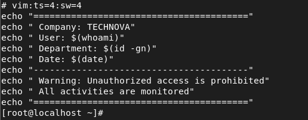
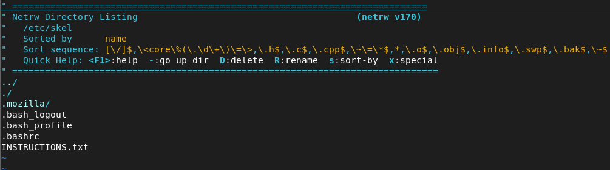
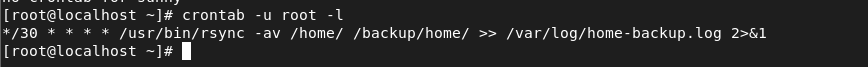
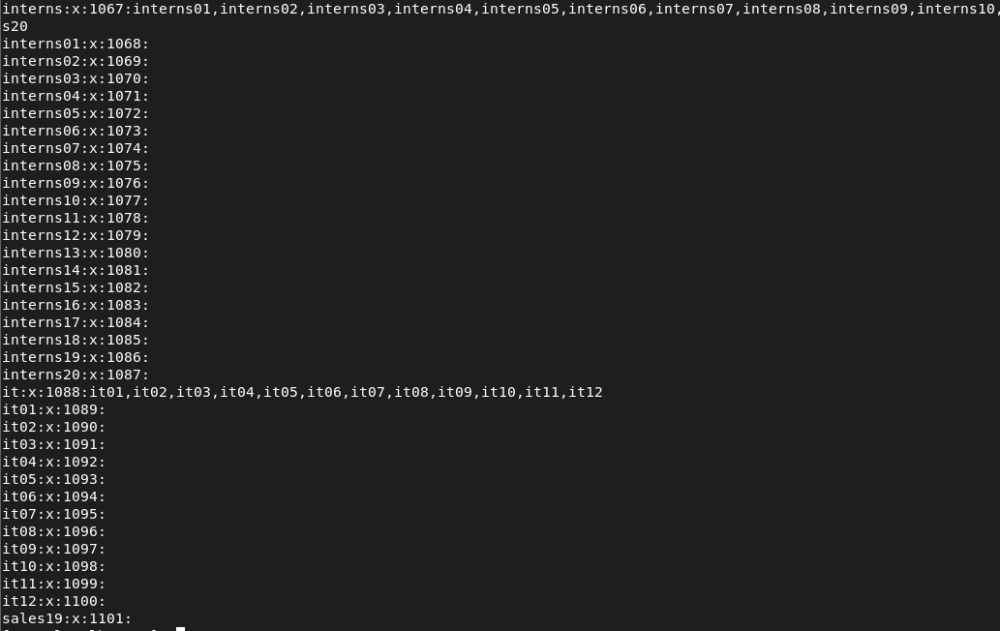
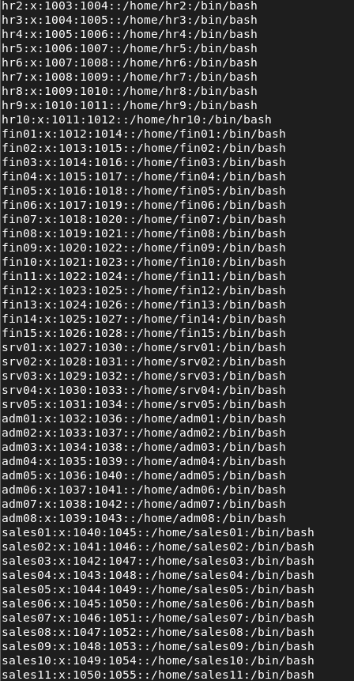
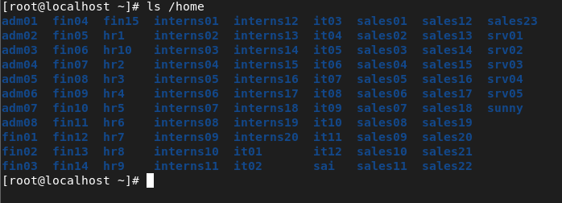

# 🔐 TECHNOVA — Linux User Management & Security Automation System

<div align="center">

### 🏢 Enterprise Linux Administration & Security Case Study  
Simulating a real-world organizational infrastructure using Linux administration, automation, and security best practices.


</div>

---

# 📌 Overview

TECHNOVA is a **Linux administration and security automation project** designed to replicate how enterprise organizations manage users, permissions, password policies, backups, and security controls across multiple departments.

The project demonstrates practical implementation of:

- 👥 User & Group Administration  
- 🔐 Role-Based Access Control (RBAC)  
- 🔑 Password Security Policies  
- 💾 Backup Automation  
- ⏳ User Lifecycle Management  
- ⚙️ System Hardening  
- 📁 Standardized User Environment Configuration  

---

# 🏢 Enterprise Scenario

TECHNOVA consists of multiple departments requiring secure and isolated Linux access.

## 📊 Department Distribution

| Department | Users |
|------------|------:|
| HR         | 10 |
| Finance    | 15 |
| Server     | 5 |
| Admin      | 8 |
| Sales      | 23 |
| Interns    | 20 |
| IT         | 12 |

---

# 🎯 Project Objectives

✔️ Create department-wise users and groups  
✔️ Enforce password expiration policies  
✔️ Implement secure directory permissions  
✔️ Automate backups using Cron + Rsync  
✔️ Configure account expiration for temporary users  
✔️ Standardize default user environments using `/etc/skel`  
✔️ Configure organization-wide login security banner  

---

# 🛠️ Technologies & Tools

| Technology | Purpose |
|------------|----------|
| 🐧 Linux (RHEL / Kali) | Operating Environment |
| 💻 Bash Scripting | Automation |
| ⏰ Cron Jobs | Task Scheduling |
| 🔄 Rsync | Backup Automation |
| 🔐 Linux Security Utilities | System Hardening |

---

# ⚙️ Core Features

---

## 👥 1. User & Group Management

### Implemented Features
- Department-wise group creation
- Bulk user provisioning
- Naming convention standardization
- Verification using `/etc/passwd` and `/etc/group`

### Example

```bash
groupadd finance
useradd -G finance fin01
```

---

## 🔐 2. Password Policy Enforcement

Password expiration policy implemented using:

```bash
chage -M 1 username
```

### Security Benefits
- Enforces periodic password changes
- Reduces risk of credential misuse
- Demonstrates enterprise security policy implementation

> 📌 Note: Real-world organizations generally use 30–90 day expiration policies.

---

## 📁 3. Role-Based Access Control (RBAC)

Directory access restricted based on department roles.

### Permission Configuration

```bash
chmod 770 /company/<department>
chown :<group> /company/<department>
```

### Benefits
- Department isolation
- Principle of least privilege
- Secure group-based access control

---

## 💾 4. Backup Automation

Automated incremental backups configured using Cron and Rsync.

### Cron Job

```bash
*/30 * * * * /usr/bin/rsync -av /home/ /backup/home/
```

### Features
- Automatic backup every 30 minutes
- Incremental synchronization
- Logging and monitoring support
- Preserves permissions and ownership

---

## ⏳ 5. Account Expiry Management

Temporary accounts automatically expire after a defined period.

### Example

```bash
usermod -e YYYY-MM-DD interns01
```

### Purpose
- Prevents unauthorized long-term access
- Simulates enterprise onboarding/offboarding lifecycle

---

## 🖥️ 6. Global Security Banner

Customized global login warning configured using:

```bash
/etc/bashrc
```

### Displays
- Security notice
- Monitoring warning
- Authorized-use message

---

## 📂 7. `/etc/skel` Standardization

Customized default environment for newly created users.

### Includes
- `INSTRUCTIONS.txt`
- Default configuration files
- Standardized onboarding environment

---

# 📸 Proof of Implementation

## 🔐 Global Security Banner


---

## 📂 /etc/skel Configuration


---

## 💾 Backup Automation


---

## 👨‍👩‍👧 Group Verification


---

## 👥 User Verification


---

## 🏠 Home Directory Users


---

# 📂 Project Structure

```bash
Linux-User-Management-Automation-TECHNOVA/
│
├── README.md
│
├── docs/
│   └── TECHNOVA-Case-Study.pdf
│
├── scripts/
│   ├── user_creation.sh
│   ├── password_policy.sh
│   ├── backup_cron.sh
│
├── configs/
│   ├── bashrc.txt
│   └── skel_INSTRUCTIONS.txt
│
├── screenshots/
│   └── (proof images)
│
└── reports/
    └── logs/
```

---

# 🚀 Installation & Usage

## 1️⃣ Clone Repository

```bash
git clone https://github.com/DANGESUNNY20/Linux-User-Management-Automation-TECHNOVA.git
```

---

## 2️⃣ Navigate to Project

```bash
cd Linux-User-Management-Automation-TECHNOVA
```

---

## 3️⃣ Execute Scripts

```bash
bash scripts/user_creation.sh
bash scripts/password_policy.sh
bash scripts/backup_cron.sh
```

---

## 4️⃣ Configure Cron Job

```bash
crontab -e
```

Add:

```bash
*/30 * * * * /usr/bin/rsync -av /home/ /backup/home/
```

---

# 🧠 Skills Demonstrated

- Linux Administration
- Bash Scripting
- Access Control Management
- System Hardening
- Security Policy Enforcement
- Backup & Recovery Planning
- Enterprise User Lifecycle Management
- Cron Automation
- Linux File Permission Management

---

# 📈 Career Relevance

This project aligns with industry roles such as:

| Role | Relevance |
|------|------------|
| 🔹 Linux System Administrator | User & Permission Management |
| 🔹 Cybersecurity Analyst | Security Hardening |
| 🔹 VAPT Engineer | Linux Security Concepts |
| 🔹 DevSecOps Engineer | Automation & Security Integration |

---

# 📄 Documentation

## 📥 Full Case Study

[📘 Download TECHNOVA Case Study](docs/TECHNOVA-Case-Study.pdf)

### Includes
- Complete implementation steps
- Commands and verification
- Enterprise scenario explanation
- Screenshots and outputs
- Security configurations

---

# 📌 Conclusion

TECHNOVA demonstrates a practical implementation of **enterprise Linux administration and security automation**, combining automation, access control, account management, and system hardening into a structured real-world case study.

The project showcases hands-on Linux administration skills relevant to modern enterprise and cybersecurity environments.

---

# 👨‍💻 Author

## Sunny Dange

📧 Email: dangesunny2021@gmail.com  
🔗 LinkedIn: www.linkedin.com/in/sunnydange  
💻 GitHub: https://github.com/DANGESUNNY20

---

<div align="center">

### ⭐ If you found this project useful, consider giving it a star!

</div>
